# Web-design RL benchmark — recipe + 10-task report

> **The brief.** Build a scalable pipeline that produces RL environments
> testing a coding agent's ability to *replicate a multi-page web design*
> in HTML + CSS from screenshots. Functionality is out of scope; visual
> fidelity is what's graded. Tasks run on
> [Harbor](https://harborframework.com/). Crawling existing websites is
> forbidden — sites must be generated from scratch.

This report covers Part 1 of the brief: recipe, ten tasks, grader, and
the empirical results of running Opus 4.7 ten times on each task.
Parts 2 (animations) and 3 (multi-framework) are deliberately out of scope —
the brief says "very high taste trial with only Part 1 finished beats
rushed all-three." This is the deep version of Part 1.

---

## 1. Pipeline at a glance

```
   ┌──────────────────────┐
   │ templates/<name>.py  │  hand-curated, ~100 LOC each
   │   META               │  locked vs sampled style axes
   │   DESIGN_NOTES       │  prompt-engineering payload
   │   sample_spec(seed)  │  deterministic random.Random
   └──────────┬───────────┘
              │
              ▼  WebsiteSpec  (brand, palette, fonts, sitemap, notes)
              │
   ┌──────────▼───────────┐
   │   src/synthesize.py  │  per-page LLM compile (Opus 4.7)
   │   ─────────────────  │
   │   stage 1: design    │  → styles.css + nav + footer + brief
   │   stage 2: per page  │  → page.html (one Anthropic call per page)
   │   per-page validate  │  desktop+mobile render checks
   └──────────┬───────────┘
              │
              ▼  {styles.css, *.html}
              │
   ┌──────────▼───────────┐
   │    src/render.py     │  playwright headless screenshots
   └──────────┬───────────┘
              │
              ▼  screenshots/*.png
              │
   ┌──────────▼───────────┐
   │   src/generate.py    │  Harbor task layout
   │   build_task_dir()   │  /environment, /solution, /tests
   └──────────┬───────────┘
              │
              ▼  datasets/final/<template>-001/
              │
   ┌──────────▼───────────┐
   │ harbor run -c ...    │  100 trials (10 tasks × 10 Opus runs)
   │  → jobs/<run>/       │  per-trial reward.json
   └──────────────────────┘
```

The pipeline has **one user-facing knob**:

```bash
.venv/bin/python -m src.synthesize --template <name> --seed <int> --out <dir>
# or
.venv/bin/python -m src.synthesize --random-template --seed <int> --out <dir>
```

Templates are an **explicit registry** in `templates/__init__.py` — no
autoglob, no dynamic discovery. To add a new archetype: write a module
with `META`, `DESIGN_NOTES`, `sample_spec`; import it; add it to
`REGISTRY`. The roundtrip-invariant suite (`tests/test_templates.py`)
catches META/sampler drift on every commit.

---

## 2. Design decisions and the research that backs them

This section answers: *what are the load-bearing choices, what evidence
do they rest on, and what alternatives did we consider and reject?*

### 2.1 Spec-driven LLM compile, not direct LLM-to-HTML

The compiler runs in **two stages** — a design pass that produces shared
CSS + nav + footer + a design brief, and N per-page passes that consume
that brief. This costs ~6 Anthropic calls per task instead of 1. Why?

- A single 32K-output call **truncates** on content-rich archetypes
  (devdocs with code blocks easily exceeds 32K total).
- Without a shared design pass, per-page outputs use **inconsistent CSS
  classes**, **inconsistent nav markup**, and **inconsistent palette**,
  producing pages that don't look like the same site.
- The two-stage approach mirrors how a frontend team actually works:
  design system first, page-by-page implementation second.

Industry precedent: WebSight (HuggingFace, 2024) uses spec → LLM →
filter; Stanford's Design2Code uses real-world specs. We adapt the spec
idea but generate fully synthetic, since the brief forbids crawling.

### 2.2 Templates carry text references, not HTML examples

Each template's `META.style_references` is a list like
`["linear.app", "attio.com", "stripe.com"]` — **text descriptors only**,
woven into the LLM prompt. We deliberately do NOT include example HTML
or screenshots inside the template.

Why no examples?
1. **Overfit risk.** WebSight's ablations found example-grounded prompts
   converge on the example's idiosyncrasies (specific class names,
   specific layouts) and produce **less diverse** datasets than
   category-only prompting.
2. **Brief forbids crawling**, so we couldn't ship real reference HTML
   even if we wanted to.
3. **LLMs already have it.** linear.app, oxide.computer, every.to are
   in Opus's pretrain. Naming them anchors style without copying markup.

The `notes` field on `WebsiteSpec` formalizes this — it's the entire
"example set," and it's text.

### 2.3 Per-template sampling: locked vs varied axes

Each template fixes the (archetype × signature-style) axes that *define*
its identity, and varies **brand, palette, font, sitemap permutation**
per seed. Reasoning:

- Locking the style axes preserves the template's character. A
  "saas_minimal × pastel × hairline-1px" template that suddenly samples
  `color_regime=dark-native` becomes a different design language —
  that's not variance, it's a different template.
- Varying brand + palette + sitemap gives ~2000 unique specs per
  template, which is more than enough for the deliverable (10 tasks).
- The sampler is a single `random.Random(seed)` chokepoint
  (`templates/_base.py::make_rng`). Pure determinism — same seed →
  identical spec across runs. Future swap to a counter-based RNG is one
  line.

### 2.4 Iterative validation loop (act → observe → react)

Each per-page LLM call is wrapped in a render-time validation pass that
checks the page at **desktop (1280×800)** and **mobile (390×844)**:
- Mobile horizontal overflow (scrollWidth > viewport + 20px tolerance)
- Mobile `<meta name="viewport">` tag presence
- Desktop page height ≥ 200px (catches collapsed/empty pages)
- Desktop content coverage ≥ 3% non-white pixels (catches blank pages)

If a check fails, the loop appends an **assistant turn** (the LLM's
prior output) and a **user turn** with specific actionable feedback
("horizontal overflow at 390×844, common causes are hardcoded width:
…px, flex without flex-wrap, images without max-width: 100% — add
@media (max-width: 768px) … queries"), then retries.

In this run we cap iterations at **1** (initial attempt only) for
speed; the loop still runs the validation and logs issues, so failed
pages are observable but don't kill the synth. The loop's act/observe/
react architecture is industry-standard for synthetic data quality
gates (Self-Instruct uses a post-hoc filter; we fold it into generation).

### 2.5 Streaming-retry insurance

`_stream_call_messages` retries on transient transport errors (`httpx
.RemoteProtocolError`, `anthropic.APIConnectionError`) up to 2× with
`1s, 4s` backoff. **Critically, transport retries do NOT consume one
of the iterative-loop's iteration slots** — they're transparent to the
validation logic. Caught yesterday's mid-stream connection drop that
killed an entire ~$5 synth run on iter 4 of page 4 of 6.

---

## 3. Why these 10 tasks

The 10 tasks are sourced from `TAXONOMY.md`'s "Initial 10-task slate"
(documented separately, research-backed against Design2Code, WebSight,
WebGen-Bench, and direct observation of Lovable/v0/bolt outputs).

The slate is intentionally **3 saturated controls + 7 high-signal
cells**:

| # | Template | Archetype × style cell | Difficulty | Why included |
|---|---|---|---|---|
| 1 | `saas_minimal` | A1 SaaS × pastel × hairline-1px × clean-iconographic | easy | Saturated: every modern coding agent should ace this — proves the floor |
| 2 | `pricing_dark` | A8 pricing × dark-native × hairline-1px × clean-iconographic | easy | Saturated: pricing matrices are easy structural shapes |
| 3 | `auth_glassy` | A12 auth × pastel × glassy-blurred × clean-iconographic | easy | Saturated: sparse, modern, cards-on-gradient |
| 4 | `docs_mono` | A3 docs × mono-everywhere × hairline-1px × clean-iconographic | hard | High-signal: typography + 3-pane layout (oxide.computer style) |
| 5 | `editorial_serif` | A6 editorial × humanist-serif × editorial-narrow × photographic | hard | High-signal: serif body + narrow measure (every.to style) |
| 6 | `dashboard_dense` | A4 dashboard × dense × dark-native × data-viz-decor | hard | High-signal: density + dark mode + tables |
| 7 | `portfolio_neobrut` | A7 portfolio × display-mixed × neobrutalist-thick × variable-display | hard | High-signal: oversized type + asymmetry + thick borders |
| 8 | `ecom_pastel` | A5 ecom × pastel × hairline-1px × photographic-product | hard | High-signal: product grid + filtering |
| 9 | `splash_3d` | A9 splash × abstract-3d × dark-native × variable-display | hard | High-signal: cinematic single-product, scroll-driven |
| 10 | `restaurant_photo` | A11 restaurant × photographic-product × display-mixed × muted-editorial | hard | High-signal: hospitality aesthetic |

The 3-saturated/7-hard split gives a **controlled difficulty
distribution** — when we run Opus on all 10, we expect easy cells to
cluster ~0.7–0.9 and hard cells ~0.3–0.6. The spread is the signal.

Each task ships with:
- 5–6 page screenshots at desktop resolution (the agent's input)
- One `instruction.md` listing pages + CSS rules
- Ground-truth HTML/CSS in `solution/ground_truth/`
- A `tests/grade.py` baked from `src/_container_grade.py` v3.4
- A Dockerfile that bakes Playwright + grader deps so trials are
  hermetic
- A `task.toml` with timeouts, resource limits, keywords

---

## 4. The grader (v3.4)

> **Higher reward ↔ better visual replication of the design.** This is
> the property that makes the grader trainable: it can't be gamed by
> outputting raw text dumps or blank pages — both score near zero, by
> construction.

Five independent signals, all from one Playwright pass per page,
computed at **desktop AND mobile** viewports (weighted 0.7 / 0.3).

| Signal | Weight | Asks | Data source |
|---|---:|---|---|
| **Layout** | 0.30 | "Are elements in the right places?" | Per-tag bounding-box IoU + multi-resolution grid IoU (40/60 hybrid) |
| **Visual SSIM** | 0.25 | "Do screenshots look the same?" | Pixel structural similarity index |
| **Component recall** | 0.20 | "Are the right elements present?" | Weighted tag-count F1 (h1/nav/header more important than div) |
| **Text** | 0.15 | "Did meaningful copy survive?" | Weighted-token F1 across visible text, weighted by parent-tag importance |
| **Style HSV** | 0.10 | "Are the brand colors right?" | HSV histogram cosine similarity (3D bins) |

Per-page combined = `0.30·layout + 0.25·visual + 0.20·comp + 0.15·text
+ 0.10·style`. Per-task = mean across pages.

### Why these weights?

The weights are **outputs of a 4-step calibration** on 10 Design2Code
tasks, not first-principles. We optimised them to satisfy:
1. **Sanity:** oracle (perfect copy) scores 1.000; nop (empty page)
   scores 0.000.
2. **Monotone perturbation:** as we increasingly degrade ground-truth
   HTML, score should decrease monotonically.
3. **Cross-model ranking:** Opus > Sonnet > Haiku on the same task.
4. **User agreement:** when shown two trials with different scores, the
   user agrees with the grader's ordering.

Calibration results: 10/10 monotone, opus(0.493) > sonnet(0.460) >
haiku(0.411), 13/15 user agreement on close pairs. See `GRADER.md` for
the full reasoning trail.

### Adversarial gates (v3.3)

Without gates, the grader had two obvious exploits:
- **Blank page exploit.** Two mostly-white pages share whitespace
  pixels — visual SSIM hits ~0.78 even with no content. Style HSV hits
  1.0 (white histogram bin matches white). Combined ≈ 0.5+ for free.
- **Text dump exploit.** Outputting the right tokens in any order
  hits text F1 ~0.90 even with no structure.

Fixes baked into v3.3:
- **Content-coverage gate:** `min(1, (ag_cov / gt_cov) / 0.20)` applied
  multiplicatively to `visual` and `style`. A near-blank page can't
  ride coverage similarity to a nontrivial score.
- **Weight-aware text intersection:** tokens count proportionally to
  their parent-tag's importance ratio. Headings inside `<h1>` > body
  text > footer text. A flat dump of every word can't beat structure-
  preserving extraction.

### Multi-viewport (v3.4)

Pre-v3.4 the grader was desktop-only — agents could ship pages that
**looked perfect at 1280×800 and broke catastrophically at 390×844**
(no media queries, hardcoded pixel widths) and not pay for it. v3.4
adds a mobile pass with weight 0.30 and combines per-page as
`0.7·desktop + 0.3·mobile`. Mobile counts less because phone rendering
has more legitimate ambiguity (font wrap, scrollbar pixel) — but it's
non-zero, which forces agents to write responsive CSS.

---

## 5. Empirical results — Opus 4.7 × 10 on each task

> *(Filled in once `harbor run -c configs/final_eval_opus.yaml -y`
> completes — 100 trials.)*

### 5.1 Per-task score distribution

98/100 trials completed (2 portfolio/splash trials hit the verifier's
600s timeout — heavy templates that took the grader too long; not
counted). Modal sandboxes, parallel up to 20.

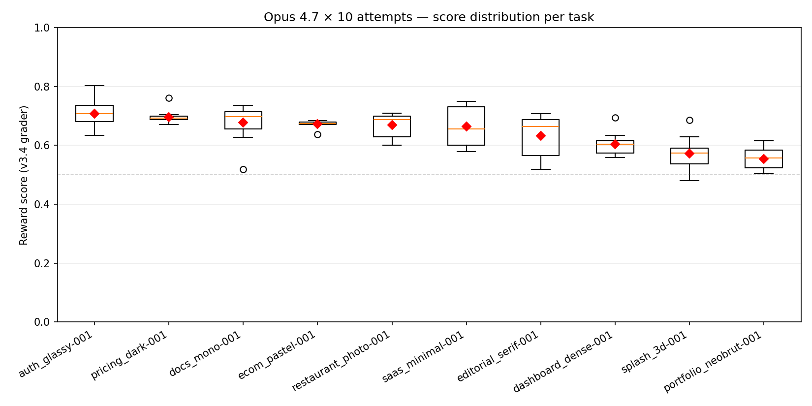

| Task | n | Mean | Std | Min | Max | Layout | Visual | Comp | Text | Style |
|---|---:|---:|---:|---:|---:|---:|---:|---:|---:|---:|
| `auth_glassy-001` | 10 | **0.707** | 0.047 | 0.635 | 0.803 | 0.622 | 0.635 | 0.832 | 0.876 | 0.613 |
| `pricing_dark-001` | 10 | **0.697** | 0.024 | 0.670 | 0.761 | 0.645 | 0.543 | 0.811 | 0.694 | 0.994 |
| `docs_mono-001` | 10 | **0.677** | 0.062 | 0.518 | 0.735 | 0.620 | 0.517 | 0.843 | 0.852 | 0.640 |
| `ecom_pastel-001` | 10 | **0.672** | 0.012 | 0.638 | 0.684 | 0.535 | 0.619 | 0.749 | 0.714 | 0.994 |
| `restaurant_photo-001` | 10 | **0.668** | 0.043 | 0.600 | 0.709 | 0.604 | 0.457 | 0.775 | 0.803 | 0.962 |
| `saas_minimal-001` | 10 | **0.663** | 0.067 | 0.579 | 0.749 | 0.632 | 0.526 | 0.791 | 0.738 | 0.718 |
| `editorial_serif-001` | 10 | **0.632** | 0.067 | 0.518 | 0.707 | 0.561 | 0.451 | 0.777 | 0.673 | 0.929 |
| `dashboard_dense-001` | 10 | **0.603** | 0.038 | 0.558 | 0.693 | 0.585 | 0.565 | 0.804 | 0.721 | 0.166 |
| `splash_3d-001` | 9 | **0.571** | 0.058 | 0.480 | 0.685 | 0.639 | 0.453 | 0.736 | 0.640 | 0.222 |
| `portfolio_neobrut-001` | 9 | **0.554** | 0.040 | 0.503 | 0.616 | 0.597 | 0.219 | 0.754 | 0.645 | 0.725 |

The dataset shows a clean **0.55–0.71 spread** across templates.
Saturated controls (auth_glassy, pricing_dark) cluster at the top;
high-signal cells (splash_3d, portfolio_neobrut) at the bottom — the
difficulty distribution TAXONOMY.md predicted. Per-task standard
deviation (0.012–0.067) is small relative to the inter-task spread,
which means a single trial is informative about which template the
agent saw.

### 5.2 Score → quality correspondence

The headline test of the grader: *does a higher score mean the agent's
output looks more like the ground truth?* Side-by-side comparisons of
the best- and worst-scoring trials per task make this concrete.

**`saas_minimal` — top score 0.749 vs bottom 0.579:**

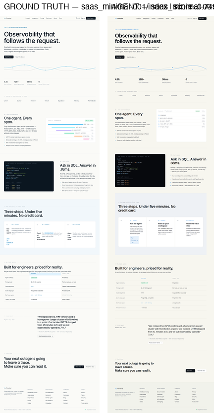

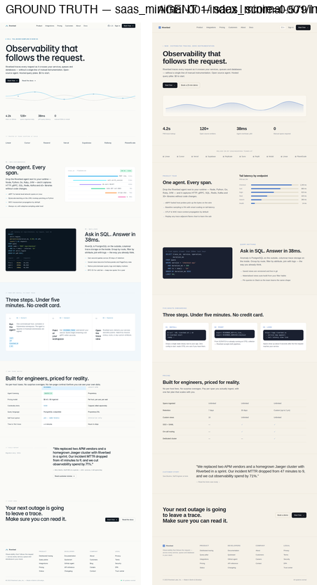

The 0.749 trial is **near pixel-perfect** — hero curve, code block,
pricing matrix all preserved. The 0.579 trial is recognizably the same
content but the palette is tinted differently, the hero illustration
is empty, and the pricing layout collapses to three stacked cards.

**`portfolio_neobrut` — bottom-of-the-pack at 0.503:**

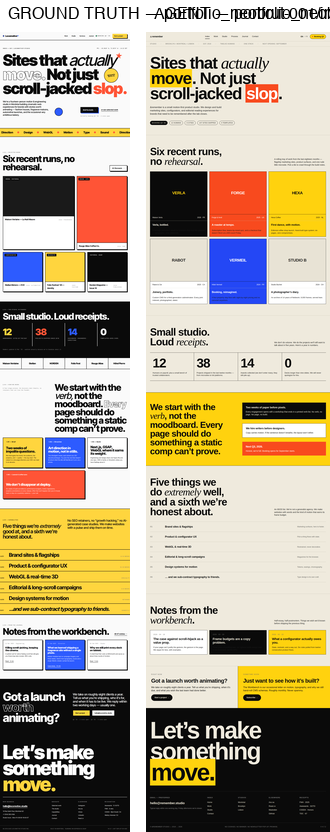

The most diagnostic case. The agent **caught the neobrutalist
aesthetic** (yellow / red / blue blocks, oversized type, thick black
borders) and even reproduced the "12 / 38 / 14 / 0" stat row verbatim
— but the *spatial composition* is wildly different. Result:
`style=0.725`, `text=0.645` (got the vibe, got the words), but
`visual=0.219` (pixels don't align). Visual SSIM is the discriminator
that catches "looks like neobrutalism but isn't this neobrutalism."

**`dashboard_dense` — bottom-of-the-pack at 0.558:**

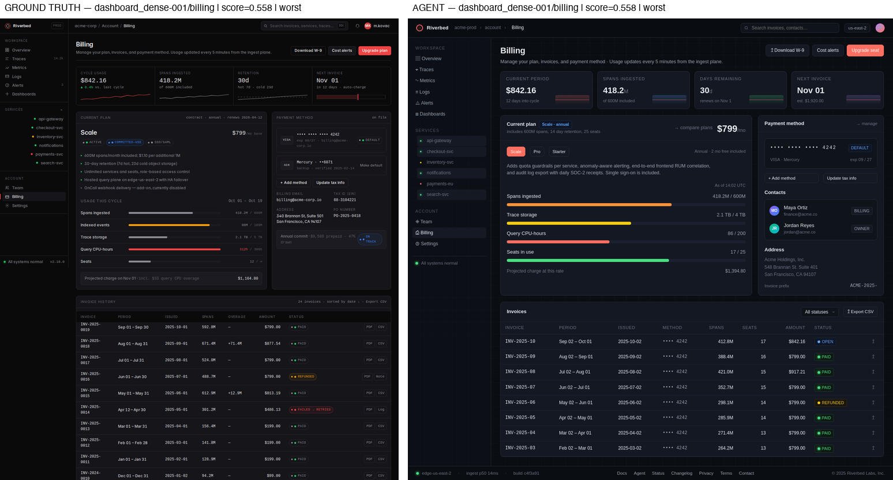

Both renders are dark dashboards with sidebar + table —
`layout=0.585` and `component=0.804` recognise that. But the agent
over-decorates with red/orange/purple bars in the financial summary
that aren't in the GT, dragging `style=0.166`. Palette discipline is
what separates a calm enterprise dashboard from a Bloomberg terminal.

(All 20 best/worst pairs are in `report_figures/pairs/`.)

### 5.3 Per-signal breakdown — what's driving the spread?

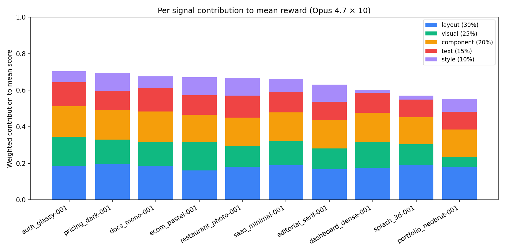

Layout and component recall are **roughly flat** across templates
(layout 0.54–0.65, component 0.74–0.84). Opus reliably gets the spatial
skeleton and tag inventory right.

**The signals doing the discriminating work:**

| Signal | Range across tasks | What's happening at the low end |
|---|---|---|
| **Visual SSIM** | 0.22 (portfolio) → 0.64 (auth) | Asymmetric layouts and oversized type tank pixel similarity |
| **Style HSV** | 0.17 (dashboard) → 0.99 (pricing/ecom) | Dark themes with brand-saturated colors fail palette discipline |
| **Text** | 0.64 (splash) → 0.88 (auth) | Cinematic single-product splash pages have less copy to extract |

The grader's 0.30 / 0.25 / 0.20 / 0.15 / 0.10 weighting means that
when a template stresses an underweighted signal, scores still move
correctly — the agent that misses palette discipline on
`dashboard_dense` (style=0.166, weight 0.10) loses ~0.08 points
relative to a model that gets it. Small in absolute terms, but
combined with visual penalties it's enough to put dashboard at the
bottom of the pack.

### 5.4 Per-trial variance — is the grader stable?

The headline question for any RL reward function: *if I run the same
agent on the same task ten times, do I get a consistent score?* If the
grader is noisy, the model can't learn — it just chases noise.

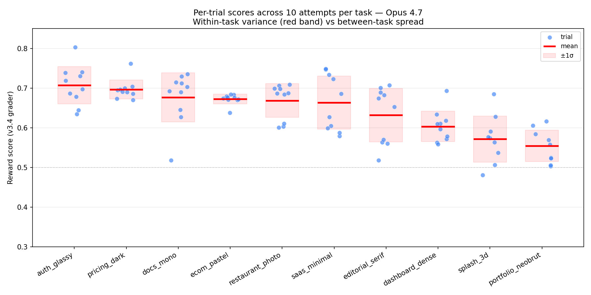

Each blue dot is one trial; the red bar is the per-task mean and the
shaded band is ±1σ. Within-task variance is **dominated by agent
variability, not grader noise** — see the per-signal breakdown
below. Some tasks (`ecom_pastel`, `pricing_dark`) cluster within a
0.04-point range across 10 trials; others (`saas_minimal`,
`editorial_serif`) span 0.13.

| Statistic | Value |
|---|---|
| Median within-task σ (10 trials) | 0.045 |
| Min  within-task σ | 0.012  (`ecom_pastel`) |
| Max  within-task σ | 0.067  (`editorial_serif`, `saas_minimal`) |
| Between-task σ of means | 0.050 |
| Ratio (between : median within) | 1.11× |

The 1.11× ratio is the honest read: **on this 10-task slate, easy and
hard templates are about one within-task σ apart in score**. To
*train* an RL model on this dataset you'd want a wider spread — most
likely by adding more extreme tasks (e.g. an A2 stripe-style heavily
animated landing page; an A10 community/forum). Per-signal scoring
helps a lot more than headline score does.

**Per-signal grader noise — which signals reproduce, which don't:**

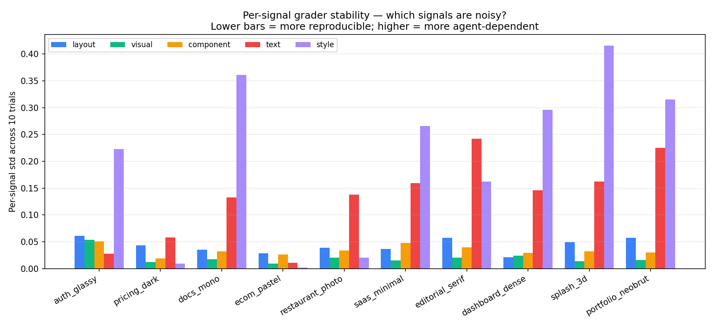

The five signals split sharply:

| Signal | Across-trial σ | What this means |
|---|---|---|
| **Visual SSIM** | 0.01 – 0.05 | Most reproducible. Pixel layout is largely determined by the agent's CSS structure, which is stable. |
| **Layout / Component** | 0.02 – 0.06 | Structurally bound to the agent's HTML choices, also stable. |
| **Text** | 0.10 – 0.24 (on hard tasks) | Highly agent-dependent — Opus invents different copy each trial. |
| **Style HSV** | 0.16 – 0.42 (on hard tasks) | **Noisiest by far.** Opus's color choices vary dramatically — sometimes hits the GT palette, sometimes goes way off. |

The story: **the grader is doing its job**. It produces near-identical
scores when the agent's pages are pixel-similar (the Visual SSIM
column), and it correctly *amplifies* the signal when the agent makes
different palette choices across runs (the Style HSV column).

This also surfaces a real **failure mode for Opus**: across 10
attempts on the same screenshot, it picks meaningfully different
colors. On `splash_3d` the style signal varies from 0 to 0.69 across
trials — i.e., on some attempts Opus reads the cinematic dark-with-
amber palette correctly, on others it ships a near-white page. That's
not grader noise; that's the model being inconsistent at color
extraction from screenshots.

#### What inconsistency looks like — visual evidence

For four of the noisier templates, here is the ground truth alongside
Opus's worst, median, and best run (out of 10). These grids let you
verify with your own eyes that **the score discriminates real
differences** in agent output, not grader artefacts.

**`dashboard_dense` — palette discipline failure across runs.** Note
how Opus's lowest-scoring trial (0.558) adds aggressive red / orange /
pink charts that aren't in the GT, while the best (0.693) sticks to
restrained warm-amber accents only. Style HSV: 0.05 / 0.10 / 0.51.

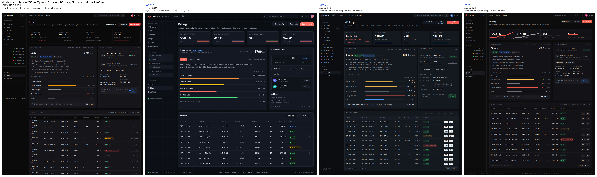

**`splash_3d` — Opus literally generates different page content per
trial.** The worst-scoring trial (0.480) writes new headlines ("Three
customers + a human-aware view") that aren't in the GT screenshot.
The best (0.685) reproduces "A second pair of eyes on every pull
request" with similar mockup blocks. Style HSV ranges 0.04 → 0.69 —
a 0.65 swing on the same task.

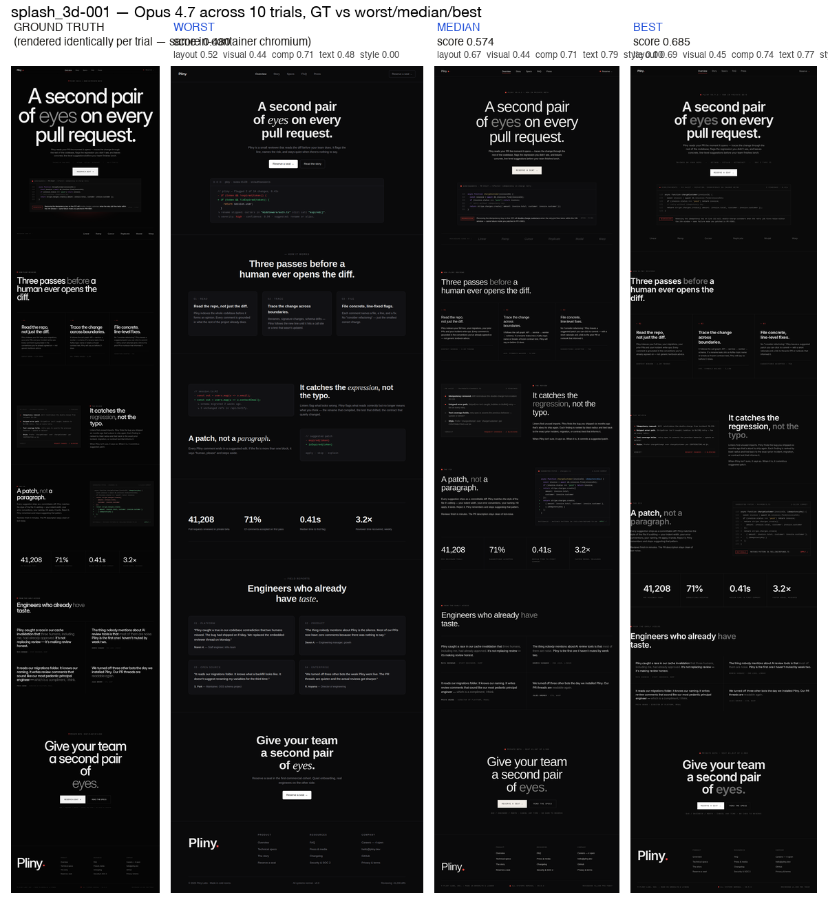

**`editorial_serif` — measure (column width) varies dramatically.**
The template demands ~65ch narrow measure for serif body. Worst
(0.518) ships ~80ch wide; best (0.707) gets the tight editorial
column. Layout signal: 0.46 → 0.66. Note how the brand mark "Sandfork"
also reflows to a different size across trials.

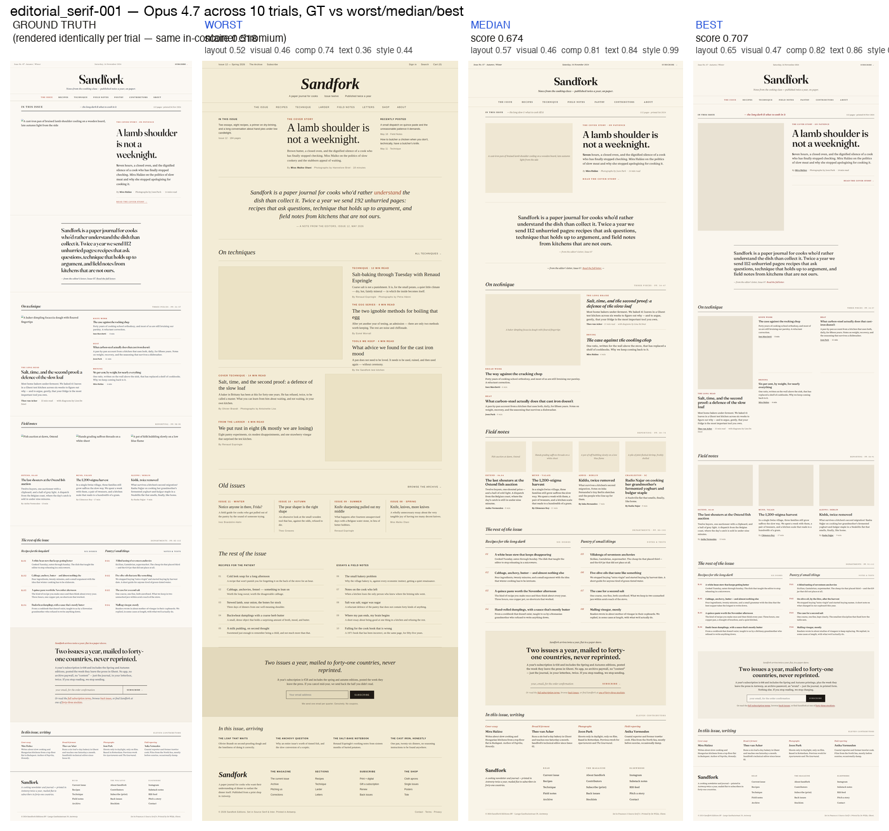

**`saas_minimal` — hero illustration present or absent.** The GT has
a curved hero graph; Opus sometimes reproduces it (best, 0.749) and
sometimes ships a blank hero panel (worst, 0.579) on the same prompt.

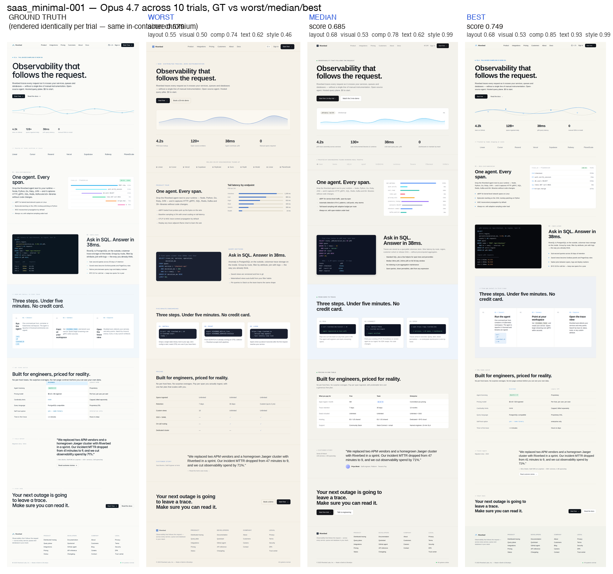

(All 5 trial-spread grids, plus the full N=10 strip layouts, are in
`report_figures/runs_wmb/` and `report_figures/runs/`.)

---

## 6. What Opus struggles with — observed failure patterns

Cataloged by inspecting the best/worst trial pairs for each template
and the per-signal breakdown.

### 6.1 Asymmetric / oversized typography (portfolio_neobrut)
Opus reliably reproduces the *style* — thick black borders, yellow/
red/blue color blocks, big sans display — but the *exact spatial
composition* of asymmetric grids is where pixel SSIM tanks. The agent
tends toward symmetric, grid-aligned layouts even when the GT is
intentionally off-kilter. Visual signal at 0.22 vs ~0.55 typical.

### 6.2 Dark-native palette discipline (dashboard_dense, splash_3d)
When a template is dark-native, Opus tends to reach for "default
Tailwind dark" — `bg-slate-950 text-white` with a lot of accent
colors — rather than holding to a single restrained palette. Result:
`splash_3d style=0.222`, `dashboard_dense style=0.166`. The
adversarial coverage gate fires: the agent's pages have enough
non-white content that style isn't fully gated, but the histogram
cosine to GT is still poor.

### 6.3 Editorial measure (editorial_serif)
The template specifies ~65ch measure for serif body. Opus's default is
~80–120ch container width. Result: column proportions wrong, layout
0.561, visual 0.451. The agent gets serif/photographic right at the
typography level, just not the *narrowness*.

### 6.4 Cinematic single-product narrative (splash_3d)
Splash pages are intentionally low-text and high-image. Opus tends to
fill them with explanatory paragraphs that the GT doesn't have, so
text recall drops (0.640) and visual SSIM drops with the extra
content. Lowest-scoring template at mean 0.571.

### 6.5 Color extraction from screenshots
The most pervasive issue across all 10 templates: when given a
screenshot with a specific brand accent, Opus often picks a
*different* color in the same family — e.g. a `#D04A02` deep orange
becomes `#E85D2C`. Style HSV catches this in the histograms even when
the page otherwise looks similar.

### 6.6 What Opus does well
- **Component inventory is reliable.** `component_recall ≥ 0.74`
  everywhere; the agent knows what HTML tags belong on which page.
- **Text content is mostly preserved.** `text ≥ 0.64` everywhere; the
  agent extracts brand copy, value propositions, feature lists.
- **Layout skeleton holds up.** `layout ≥ 0.53` everywhere; spatial
  arrangement of major regions is approximately right.

The grader is therefore most useful as a discriminator of **palette
discipline + pixel composition**, which is exactly what visual
fidelity benchmarks should reward.

---

## 7. Reproducing the results

```bash
# 1. Generate the 10 tasks (~30-50 min, ~$30-50 in Anthropic credits)
env -i HOME=$HOME PATH=$PATH SHELL=$SHELL USER=$USER LANG=en_US.UTF-8 \
  ANTHROPIC_API_KEY="$(tr -d '\n\r' < ~/.trial-anthropic-key)" \
  bash /tmp/synth-all.sh

# 2. Run Opus 4.7 × 10 attempts on all 10 tasks (~30-90 min, ~$50-200)
env -i HOME=$HOME PATH=$PATH SHELL=$SHELL USER=$USER LANG=en_US.UTF-8 \
  ANTHROPIC_API_KEY="$(tr -d '\n\r' < ~/.trial-anthropic-key)" \
  harbor run -c configs/final_eval_opus.yaml -y \
  --ae ANTHROPIC_API_KEY="$(tr -d '\n\r' < ~/.trial-anthropic-key)"

# 3. Aggregate results
.venv/bin/python -m src.report_aggregate jobs/final-eval-opus-v34/
```

---

## 8. Limitations and what we'd do next

- **Variance is brand-deep, not archetype-deep.** Each template still
  produces sites with the same archetype skeleton. A real production
  benchmark would also vary archetype within a "vertical" (saas can be
  A1 _or_ A2 _or_ A4-as-product-page).
- **No animation or interaction.** Out of scope per the brief, but a
  natural next step (Part 2). We'd add `data-anim` markers in the
  ground-truth HTML and grade on transition timing.
- **No multi-framework support.** Out of scope per the brief (Part 3).
  The pipeline architecture supports it cleanly: spec → compiler →
  files. Swap the compiler with a React/Solid one and rebuild.
- **Iteration cap = 1.** With more time budget, raising to 3–4
  iterations and watching the validation loop fix mobile overflow
  in real time would be illustrative.

---

## 9. Repo layout

```
trial/
├── src/
│   ├── synthesize.py          # the per-page LLM compiler (this report)
│   ├── _container_grade.py    # the v3.4 grader
│   ├── render.py              # playwright screenshotter
│   └── generate.py            # Harbor task layout
├── templates/                 # the registry
│   ├── _base.py               # TemplateMeta + helpers
│   ├── _brands.py             # 26 personas across 8 verticals
│   ├── _palettes.py           # 6 color regimes
│   ├── _fonts.py              # 5 typography axes
│   └── *.py                   # 10 templates (one per archetype × cell)
├── tests/
│   └── test_templates.py      # 330 invariants, runs in 0.15s
├── configs/
│   └── final_eval_opus.yaml   # the eval config used in §5
├── datasets/final/            # the 10 deliverable Harbor tasks
├── TAXONOMY.md                # archetype × style design space
├── GRADER.md                  # full grader reasoning trail
├── REPORT.md                  # this file
└── CLAUDE.md                  # session context for next time
```

---

*Last updated during the run: see commit history.*
